# Sailing Regatta Timer
<!-- TOC depthFrom:1 depthTo:6 withLinks:1 updateOnSave:1 orderedList:0 -->

- [Sailing Regatta Timer](#sailing-regatta-timer)
  - [Key Features](#key-features)
  - [Timing \& Buzzer Sequencing](#timing--buzzer-sequencing)
  - [Wiring Diagram](#wiring-diagram)
    - [Written Connections](#written-connections)
    - [Visual Diagram (Mermaid)](#visual-diagram-mermaid)
  - [Parts list](#parts-list)
  - [Tools](#tools)

<!-- /TOC -->
## Key Features

- on/off button to save battery

- buzzer button for direct connection
- timer buttons for; 1 minute, 2 minute, 3 minute and 5 minute durations
- support for external reset switch

## Timing & Buzzer Sequencing

When a timer button is pressed, the system plays a predefined sequence of long and short buzzer sounds corresponding to the remaining time before the start. The timers count down to zero.

| Time Remaining | 5-Minute Sequence | 3-Minute Sequence | 2-Minute Sequence | 1-Minute Sequence |
|---|---|---|---|---|
| **5:00** | 1 Long | - | - | - |
| **4:00** | 1 Long | - | - | - |
| **3:00** | - | 3 Long | - | - |
| **2:00** | - | 2 Long | 2 Long | - |
| **1:30** | - | 1 Long, 3 Short | 1 Long, 3 Short | - |
| **1:00** | 1 Long | 1 Long | 1 Long | 1 Long |
| **0:30** | - | 3 Short | 3 Short | 3 Short |
| **0:20** | - | 2 Short | 2 Short | 2 Short |
| **0:10** | - | 1 Short | 1 Short | 1 Short |
| **0:05 to 0:01** | - | 1 Short* | 1 Short* | 1 Short* |
| **0:00 (Start)**| 1 Long | 1 Long | 1 Long | 1 Long |

*\*1 Short buzzer fires every second for the last 5 seconds (0:05, 0:04, 0:03, 0:02, and 0:01).*

## Wiring Diagram

### Written Connections

1. **Main Power:** Battery (+) → Toggle Switch → **12V Positive Rail**.  
2. **12V Power Indicator:** 12V Positive Rail → **12V LED** (+) | **12V LED** (-) → Ground.
3. **Arduino Power:** 12V Positive Rail → Buck Converter (In) → 5V Out → Arduino **VIN** pin.  
4. **5V Power Indicator:** 5V Out (from Buck Converter) → **5V LED** (+) | **5V LED** (-) → Ground.
5. **Siren Control (via 12V Relay):**  
   - **Relay Power & Control:**
     - Relay **DC+** → 12V Positive Rail.
     - Relay **DC-** → Ground.
     - Relay **IN** → Arduino **D8**.
   - **Siren Circuit:**
     - Relay **COM** → 12V Positive Rail.
     - Relay **NO** (Normally Open) → Siren (+).
     - Siren (-) → Ground.  
6. **Buttons (Timer):** Connect Pins **D4 (1m), D5 (2m), D6 (3m), D7 (5m)** to one side of buttons; other side to **GND**.  
7. **Display:** **D2** (CLK), **D3** (DIO), 5V, and GND.
8. **External Reset Switch:** Arduino **RESET** pin → Momentary Button → Ground.

### Visual Diagram (Mermaid)

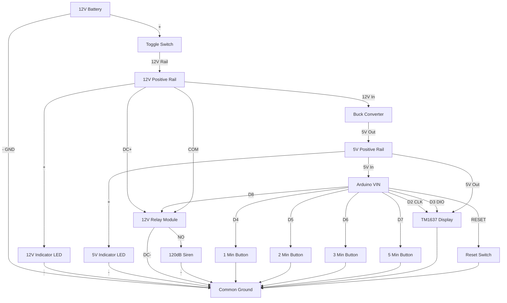

## Parts list

- Quantity = 1 unless otherwise specified

- Total cost approximately $116 (there will be extra parts)

|Item|Description|Ref URL|Approx USD price|Image|
|---|---|---|---|---|
|1|ELEGOO Presoldered Nano Boards with USB Cable Compatible with Arduino IDE Microcontroller Mini Board ATmega+328P CH340 Chip|[Ref URL](https://www.amazon.com/gp/product/B0D5LYFRQP/ref=sw_img_1?smid=A2WWHQ25ENKVJ1&psc=1)|16|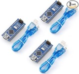|
|2|HiLetgo 3pcs Nano V3.0 3.0 Controller Terminal Adapter Expansion Board Nano IO Shield Simple Extension Plate for Arduino Mano AVR ATMEGA328P|[Ref URL](https://www.amazon.com/dp/B073JGV87F/?coliid=I365C7R2YW0D2I&colid=2PJ78PQT8EM7D&psc=1&ref_=list_c_wl_lv_ov_lig_dp_it)|9|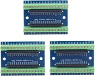|
|3|Xnrtop DC12 V 120 db Continuous Sound Decibel Piezo Buzzer IC Alarm Speaker 2 PCS|[Ref URL](https://www.amazon.com/dp/B07K2Z76NB/?coliid=I2TSJSATCNOU6O&colid=2PJ78PQT8EM7D&psc=1&ref_=list_c_wl_lv_ov_lig_dp_it)|10|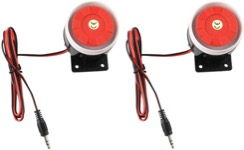|
|4|AEDIKO 4pcs DC 12V Relay Module 1 Channel Relay Board with Optocoupler Isolation Support High or Low Level|[Ref URL](https://www.amazon.com/dp/B095YFJ69T/?coliid=IOA3D4Z57WT60&colid=2PJ78PQT8EM7D&psc=1&ref_=list_c_wl_lv_ov_lig_dp_it)|7|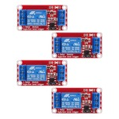|
|5|WWZMDiB 4 Digit 7 Segment Digital Tube LED Display Board for Arduino (5 Pcs)|[Ref URL](https://www.amazon.com/dp/B0BFQNFX6D/?coliid=I39HWHOUK9ZGCR&colid=2PJ78PQT8EM7D&psc=1&ref_=list_c_wl_lv_ov_lig_dp_it)|8|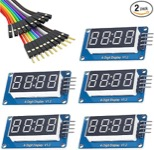|
|6|Round Rocker Switch, 12V Toggle Switch, Waterproof Lighted LED|[Ref URL](https://www.amazon.com/gp/product/B0D91HGCCR/ref=ppx_yo_dt_b_search_asin_title?ie=UTF8&th=1)|6|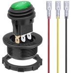|
|7|8mm 3V-4.5V-5V-6V-7.5V-9VDC LED Metal Indicator Light Waterproof Signal Lamp|[Ref URL](https://www.amazon.com/dp/B09L7W7HKL?ref=ppx_yo2ov_dt_b_fed_asin_title&th=1)|8|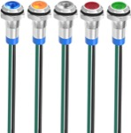|
|8|12V 7Ah (7.2Ah) Lithium LiFePO4 Deep Cycle Battery|[Ref URL](https://www.amazon.com/gp/product/B0B78HTRDL/ref=ppx_yo_dt_b_search_asin_title?ie=UTF8&th=1)|27|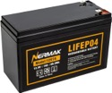|
|9|Twidec/12PCS 12V 250V Momentary Push Button Switch 2 Pins SPST 7mm 6 Colors|[Ref URL](https://www.amazon.com/dp/B07RTZVZ6L?ref=ppx_yo2ov_dt_b_fed_asin_title&th=1)|8|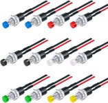|
| |(Note: 4 for timers, 1 for buzzer, 1 for reset, 6 spares)|| | |
|10|BUNKER HILL SECURITY 0.50 Caliber Ammo Box|[Ref URL](https://www.harborfreight.com/050-caliber-ammo-box-57766.html)|9||
|11|5 Pack LM2596 DC to DC Buck Converter 3.0-40V to 1.5-35V Adjustable Voltage Regulator Electronic Voltage Stabilizer Power Supply Step Down Module|[Ref URL](https://www.amazon.com/dp/B0DBVYP91F?psc=1&smid=A2E1XB0KAFTH8V&ref_=chk_typ_imgToDp)|8|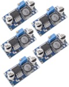|

## Tools

|item|description|[Ref URL](reference url)|(approx USD price)| Image |
|---|---|---|---|---|
|1|Arduino IDE|[Ref URL](https://www.arduino.cc/en/software)|0| NA |
|2|KiCAD (schematic, board layout)|[Ref URL](https://kicad.org/)|0| NA |
|3|Fanttik T1 Max Soldering Iron Kit|[Ref URL](https://www.amazon.com/gp/product/B0D41ZMDPD/ref=ox_sc_saved_title_1?smid=A30MIYRTO6RN4I&psc=1)|80|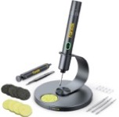|
|4|IRWIN VISE-GRIP Wire Stripper|[Ref URL](https://www.amazon.com/dp/B000OQ21CA?ref=ppx_yo2ov_dt_b_fed_asin_title&th=1)|25|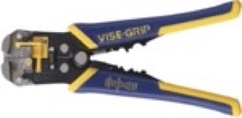|
|5|KOTTO Strong Suction Smoke Absorber|[Ref URL](https://www.amazon.com/dp/B07ZHH5H7N?ref=ppx_yo2ov_dt_b_fed_asin_title)|80|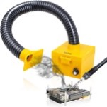|
